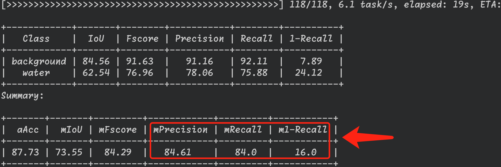

# 🎉

这是一个关于 ***城市道路积水检测*** 的项目。代码实现基于开源框架 `pytorch` 和 `openMMsegmentation`。

下面将介绍如何对我们训练好的模型进行测试:

## step1: 配置环境
```bash
conda create -n waterseg python=3.8 #01 创建python3.8的环境waterseg
conda activate waterseg             #02 激活环境

conda install pytorch torchvision -c pytorch 
pip3 install torch torchvision torchaudio --index-url https://download.pytorch.org/whl/cu118
#03 安装pytorch cpu 或者 gpu版本, 二选一

pip install -U openmim
mim install mmcv-full               #04 安装mmcv
pip install -v -e .                 #05 安装其他所需的包
```

## step2: 数据集准备

将需要进行测试的数据集放入文件夹 data/ 中；
data目录为:

    data/
        img/     # 数据集图片
        label/   # 数据集标签

注意：标签需要处理为像素值$0-1$，而不是$0-255$。

## step3: 修改配置文件
修改数据集配置文件: `./config/_base_/datasets/WaterDataset_360x640.`py
```python
# dataset settings
dataset_type = 'OurWater'
data_root = ''   # 公司数据集存放的根路径;

# ...

data = dict(
    samples_per_gpu=4,
    workers_per_gpu=1,
    test=dict(
        type=dataset_type,
        data_root=data_root,
        #img_dir='test/img',
        img_dir='test/img_png',             # 测试集图片存放的文件夹名: 图片;
        ann_dir='test/label_gray01_png',    # 测试集图片存放的文件夹名: 标签;
        pipeline=test_pipeline))
```
    
## step4: 开始测试

在准备数据和修改配置文件之后，您可以开始测试了。请按照以下步骤进行操作：

1. 运行测试脚本 `python test.py`。
2. 出现证明测试模型成功🏅。

## 反馈和贡献
如果您在使用过程中遇到任何问题或有任何建议，请随时提出反馈。我们欢迎您的贡献！

## 版权信息
MMSegmentation is released under the Apache 2.0 license, while some specific features in this library are with other licenses. Please refer to [LICENSES.md](https://github.com/open-mmlab/mmsegmentation/blob/0.x/LICENSES.md) for the careful check, if you are using our code for commercial matters.

